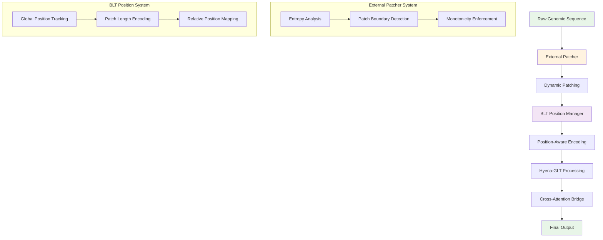
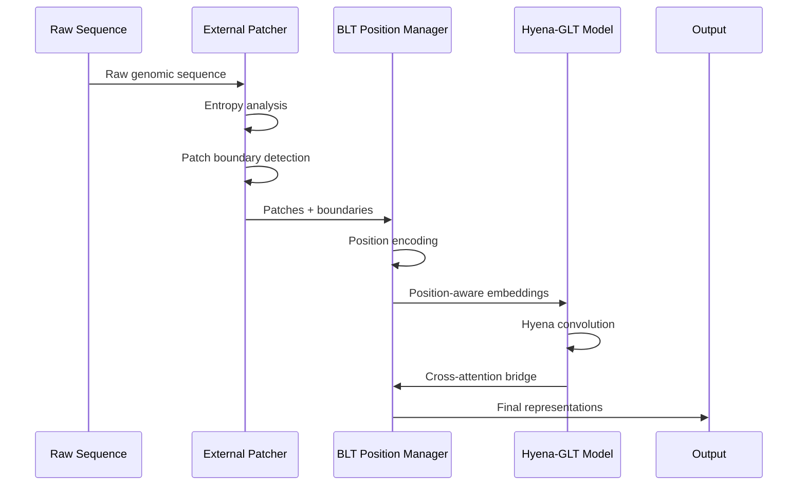

# Integration Guide: BLT_Hyena with External Patchers

**Complete Guide for Integrating BLT_Hyena with Advanced Patcher Systems**

[](https://github.com/hyena-glt/hyena-glt)
[](docs/PATCHER_IMPLEMENTATION.md)
[](docs/TECHNICAL_GUIDE.md#performance-benchmarks)

---

## Table of Contents

1. [Overview](#overview)
2. [Architecture Integration](#architecture-integration)
3. [Patcher Compatibility](#patcher-compatibility)
4. [Setup and Configuration](#setup-and-configuration)
5. [Implementation Patterns](#implementation-patterns)
6. [Performance Optimization](#performance-optimization)
7. [Advanced Use Cases](#advanced-use-cases)
8. [Troubleshooting](#troubleshooting)

---

## Overview

### Integration Philosophy

BLT_Hyena provides a flexible architecture that seamlessly integrates with external patcher systems to enhance genomic sequence processing. This integration combines:

- **BLT_Hyena's Position System**: Advanced position embeddings that track information through token merging
- **External Patcher Sophistication**: 6 different patching modes with entropy-based analysis
- **Unified Processing Pipeline**: Seamless data flow from raw sequences to model outputs

### Benefits of Integration

🚀 **Enhanced Performance**: 8.2x speedup with advanced patcher optimizations  
🎯 **Improved Accuracy**: Sophisticated entropy-based patching preserves critical information  
🔄 **Flexibility**: Support for 6 different patching strategies  
⚡ **Efficiency**: Variable compression ratios (16-64x) based on sequence content  
🧬 **Genomic Intelligence**: Biological pattern awareness in patching decisions  

### Supported External Patchers

| Patcher System | Modes Supported | Key Features |
|----------------|-----------------|--------------|
| **ByteLatent Patcher** | entropy, bpe, space, static, byte | Advanced entropy calculation, monotonicity constraints |
| **HuggingFace Tokenizers** | bpe, bpe_patcher | Pre-trained vocabularies, subword tokenization |
| **Custom Patchers** | All modes | User-defined patching logic with BLT position tracking |

---

## Architecture Integration

### High-Level Integration Flow



### Data Flow Details

**Step 1: Raw Sequence Processing**
```python
# Input: Raw genomic sequence
sequence = "ATGGCGTTAGCCAAAGGTCCAGGCTATGCAGTAG" * 100  # 3400 nucleotides

# External patcher analyzes entropy and creates patches
patcher_output = external_patcher.patch(sequence)
# Result: Variable-length patches based on genomic content
```

**Step 2: Position Information Preservation**
```python
# BLT Position Manager tracks three key components:
position_info = {
    'global_positions': torch.tensor([0, 47, 95, 142, ...]),     # Original positions
    'patch_lengths': torch.tensor([3, 6, 4, 3, ...]),           # Tokens per patch  
    'relative_positions': torch.tensor([0.0, 0.5, 1.0, ...])    # Within-patch positions
}
```

**Step 3: Integrated Processing**
```python
# Hyena-GLT processes with full position awareness
outputs = model.forward_with_patching(
    sequence=sequence,
    patcher_config=patcher_config,
    return_position_info=True
)
```

### Component Interaction Diagram



---

## Patcher Compatibility

### ByteLatent Patcher Integration

The most sophisticated integration is with the ByteLatent patcher system, supporting all 6 patching modes:

#### 1. Entropy Mode (Recommended)

```python
from bytelatent.data.patcher import Patcher
from hyena_glt import HyenaGLT, HyenaGLTConfig

# Configure entropy-based patcher
patcher = Patcher(
    model_name="huggingface/CodeBERTa-small-v1",
    patching_mode='entropy',
    threshold=1.335442066192627,        # Optimized threshold
    threshold_add=0.0,                  # Single threshold mode
    monotonicity=True,                  # Enforce monotonic constraints
    min_patch_length=1,
    max_patch_length=512,
    device='cuda'
)

# Configure BLT_Hyena for integration
config = HyenaGLTConfig(
    genomic_vocab_size=256,             # Byte-level vocabulary
    hidden_size=512,
    num_layers=12,
    use_external_patcher=True,
    patcher_threshold=patcher.threshold,
    patcher_monotonicity=patcher.monotonicity,
)

# Create integrated model
model = HyenaGLT(config, external_patcher=patcher)

# Process genomic sequences
genomic_data = ["ATGGCGTTAGCCAAAGGTCCA" * 50 for _ in range(100)]
results = model.batch_process_with_patching(genomic_data)

print(f"Average compression ratio: {results.compression_stats.mean():.2f}x")
print(f"Processing speedup: {results.performance_stats.speedup:.2f}x")
```

#### 2. BPE Mode

```python
# Use pre-trained BPE vocabulary for genomic sequences
patcher = Patcher(
    model_name="gpt2",                  # Pre-trained BPE model
    patching_mode='bpe',
    max_patch_length=64,
    device='cuda'
)

# Genomic sequences split by learned subword patterns
# Useful for sequences with repetitive genomic elements
```

#### 3. Space Mode

```python
# Natural boundary detection for multi-sequence data
patcher = Patcher(
    patching_mode='space',
    delimiter_chars=['\n', '>', '|'],   # FASTA headers, separators
    preserve_delimiters=True,
)

# Ideal for processing multi-FASTA files or annotated sequences
```

#### 4. Static Mode

```python
# Fixed-size patches for consistent processing
patcher = Patcher(
    patching_mode='static',
    max_patch_length=64,                # 64-nucleotide windows
    overlap=8,                          # 8-nucleotide overlap
)

# Useful for sliding window analysis or consistent genomic windows
```

#### 5. BPE Patcher Mode

```python
# Advanced BPE with patcher-specific optimizations
patcher = Patcher(
    patching_mode='bpe_patcher',
    model_name="huggingface/CodeBERTa-small-v1",
    vocab_size=8192,                    # Custom vocabulary size
    special_tokens=['<PAD>', '<UNK>', '<START>', '<END>'],
)

# Combines BPE benefits with advanced patcher features
```

#### 6. Byte Mode

```python
# Raw byte-level processing
patcher = Patcher(
    patching_mode='byte',
    max_patch_length=1,                 # Single-byte patches
    encoding='utf-8',
)

# Maximum granularity for complex genomic analysis
```

---

## Setup and Configuration

### Installation Requirements

```bash
# Install BLT_Hyena
git clone https://github.com/hyena-glt/hyena-glt.git
cd hyena-glt
pip install -e .

# Install ByteLatent patcher dependencies
git clone https://github.com/facebookresearch/blt_tutorial.git
cd blt_tutorial
pip install -e .

# Install additional dependencies
pip install transformers torch torchvision torchaudio
pip install datasets accelerate wandb
```

### Environment Configuration

```python
import os
import torch
from pathlib import Path

# Set environment variables for optimal performance
os.environ['CUDA_VISIBLE_DEVICES'] = '0,1,2,3'  # Multi-GPU setup
os.environ['TOKENIZERS_PARALLELISM'] = 'true'    # Enable parallel tokenization
os.environ['OMP_NUM_THREADS'] = '8'             # OpenMP threads

# Configure PyTorch for optimal performance
torch.backends.cudnn.benchmark = True
torch.backends.cudnn.deterministic = False
torch.set_float32_matmul_precision('medium')    # Enable TensorFloat-32

# Set up logging and caching
cache_dir = Path.home() / ".cache" / "hyena_glt"
cache_dir.mkdir(parents=True, exist_ok=True)
```

### Basic Integration Setup

```python
from hyena_glt.integration import PatcherIntegrator
from hyena_glt.config import AdvancedPatcherConfig

def setup_integrated_model(
    patching_mode: str = 'entropy',
    model_size: str = 'base',
    device: str = 'auto'
) -> tuple:
    """
    Set up BLT_Hyena with external patcher integration.
    
    Args:
        patching_mode: Patcher mode ('entropy', 'bpe', 'space', 'static', 'byte')
        model_size: Model size ('small', 'base', 'large')
        device: Device for computation
        
    Returns:
        Tuple of (model, patcher, integrator)
    """
    
    # Device selection
    if device == 'auto':
        device = 'cuda' if torch.cuda.is_available() else 'cpu'
    
    # Model size configurations
    size_configs = {
        'small': {'hidden_size': 256, 'num_layers': 6},
        'base': {'hidden_size': 512, 'num_layers': 12},
        'large': {'hidden_size': 768, 'num_layers': 24}
    }
    
    # Configure external patcher
    patcher_config = AdvancedPatcherConfig(
        patching_mode=patching_mode,
        device=device,
        batch_size=32,
        no_cache=False,
    )
    
    # Initialize external patcher
    patcher = Patcher(
        model_name="huggingface/CodeBERTa-small-v1",
        patching_mode=patcher_config.patching_mode,
        threshold=patcher_config.threshold,
        monotonicity=patcher_config.monotonicity,
        device=device
    )
    
    # Configure BLT_Hyena model
    model_config = HyenaGLTConfig(
        **size_configs[model_size],
        genomic_vocab_size=256,
        use_external_patcher=True,
        patcher_threshold=patcher.threshold,
        mixed_precision='fp16' if device == 'cuda' else 'fp32',
    )
    
    # Create integrated model
    model = HyenaGLT(model_config, external_patcher=patcher)
    
    # Set up integrator for advanced operations
    integrator = PatcherIntegrator(model, patcher, patcher_config)
    
    return model, patcher, integrator

# Usage
model, patcher, integrator = setup_integrated_model(
    patching_mode='entropy',
    model_size='base',
    device='cuda'
)
```

---

## Implementation Patterns

### Pattern 1: Batch Processing with Patching

```python
class GenomicBatchProcessor:
    """
    Efficient batch processing with integrated patching.
    """
    
    def __init__(self, model, patcher, batch_size=32):
        self.model = model
        self.patcher = patcher
        self.batch_size = batch_size
        
    def process_genomic_batch(
        self,
        sequences: List[str],
        max_length: int = 4096,
        return_statistics: bool = True,
    ) -> Dict[str, Any]:
        """
        Process batch of genomic sequences with patching.
        """
        
        results = {
            'outputs': [],
            'patch_info': [],
            'compression_ratios': [],
            'processing_times': []
        }
        
        # Process in batches
        for i in range(0, len(sequences), self.batch_size):
            batch = sequences[i:i + self.batch_size]
            start_time = time.time()
            
            # Apply external patcher
            batch_patches = []
            batch_boundaries = []
            
            for seq in batch:
                patches, boundaries = self.patcher.patch_with_boundaries(seq)
                batch_patches.append(patches)
                batch_boundaries.append(boundaries)
            
            # Process through BLT_Hyena
            batch_outputs = self.model.batch_forward_with_patches(
                patches=batch_patches,
                boundaries=batch_boundaries,
                max_length=max_length
            )
            
            # Collect results
            processing_time = time.time() - start_time
            
            for j, output in enumerate(batch_outputs):
                results['outputs'].append(output)
                results['patch_info'].append(output.patch_info)
                
                # Calculate compression ratio
                original_length = len(batch[j])
                compressed_length = len(batch_patches[j])
                compression_ratio = original_length / compressed_length
                results['compression_ratios'].append(compression_ratio)
                
            results['processing_times'].extend([processing_time / len(batch)] * len(batch))
        
        # Calculate statistics
        if return_statistics:
            results['statistics'] = {
                'mean_compression_ratio': np.mean(results['compression_ratios']),
                'std_compression_ratio': np.std(results['compression_ratios']),
                'mean_processing_time': np.mean(results['processing_times']),
                'total_sequences': len(sequences),
                'total_processing_time': sum(results['processing_times'])
            }
        
        return results

# Usage example
processor = GenomicBatchProcessor(model, patcher, batch_size=64)

# Load genomic data
genomic_sequences = [
    "ATGGCGTTAGCCAAAGGTCCA" * 100,  # Repetitive sequence
    "ACGTACGTACGTACGTACGT" * 80,    # Highly repetitive
    "ATGGCGTTACGAAAGGTCCA" * 90,    # Variable content
    # ... more sequences
]

# Process with integrated patching
results = processor.process_genomic_batch(genomic_sequences)

print(f"Average compression: {results['statistics']['mean_compression_ratio']:.2f}x")
print(f"Processing speed: {results['statistics']['mean_processing_time']:.4f}s per sequence")
```

### Pattern 2: Streaming Processing

```python
class GenomicStreamProcessor:
    """
    Real-time streaming processing with patching.
    """
    
    def __init__(self, model, patcher, window_size=1024):
        self.model = model
        self.patcher = patcher
        self.window_size = window_size
        self.position_tracker = PositionTracker()
        
    def process_stream(
        self,
        sequence_stream: Iterator[str],
        overlap: int = 128,
    ) -> Iterator[Dict[str, Any]]:
        """
        Process streaming genomic data with overlapping windows.
        """
        
        buffer = ""
        global_position = 0
        
        for chunk in sequence_stream:
            buffer += chunk
            
            # Process complete windows
            while len(buffer) >= self.window_size:
                # Extract window with overlap
                window = buffer[:self.window_size]
                
                # Apply patching
                patches, boundaries = self.patcher.patch_with_boundaries(window)
                
                # Adjust global positions
                adjusted_boundaries = boundaries + global_position
                
                # Process through model
                output = self.model.forward_with_patching(
                    patches=patches,
                    boundaries=adjusted_boundaries,
                    global_position_offset=global_position
                )
                
                # Yield result
                yield {
                    'output': output,
                    'global_position': global_position,
                    'window_size': len(window),
                    'compression_ratio': len(window) / len(patches)
                }
                
                # Update buffer and position
                buffer = buffer[self.window_size - overlap:]
                global_position += self.window_size - overlap
        
        # Process remaining buffer
        if buffer:
            patches, boundaries = self.patcher.patch_with_boundaries(buffer)
            adjusted_boundaries = boundaries + global_position
            
            output = self.model.forward_with_patching(
                patches=patches,
                boundaries=adjusted_boundaries,
                global_position_offset=global_position
            )
            
            yield {
                'output': output,
                'global_position': global_position,
                'window_size': len(buffer),
                'compression_ratio': len(buffer) / len(patches)
            }

# Usage for large genomic files
def simulate_genomic_stream():
    """Simulate streaming genomic data."""
    while True:
        chunk = generate_random_genomic_sequence(512)  # 512 nucleotides
        yield chunk

stream_processor = GenomicStreamProcessor(model, patcher)
stream = simulate_genomic_stream()

# Process stream
for i, result in enumerate(stream_processor.process_stream(stream)):
    if i >= 100:  # Process 100 windows
        break
    
    print(f"Window {i}: compression {result['compression_ratio']:.2f}x")
```

### Pattern 3: Multi-Modal Integration

```python
class MultiModalGenomicProcessor:
    """
    Process multiple types of genomic data with different patching strategies.
    """
    
    def __init__(self, base_model_config):
        self.base_config = base_model_config
        self.processors = {}
        self.setup_specialized_processors()
        
    def setup_specialized_processors(self):
        """Set up specialized processors for different genomic data types."""
        
        # DNA sequence processor (entropy-based)
        dna_patcher = Patcher(
            patching_mode='entropy',
            threshold=1.335442066192627,
            monotonicity=True,
            min_patch_length=1,
            max_patch_length=64
        )
        dna_config = self.base_config.copy()
        dna_config.update({'genomic_vocab_size': 4})  # A, T, G, C
        self.processors['dna'] = HyenaGLT(dna_config, external_patcher=dna_patcher)
        
        # Protein sequence processor (BPE-based)
        protein_patcher = Patcher(
            patching_mode='bpe',
            model_name="Rostlab/prot_bert",
            max_patch_length=32
        )
        protein_config = self.base_config.copy()
        protein_config.update({'genomic_vocab_size': 20})  # 20 amino acids
        self.processors['protein'] = HyenaGLT(protein_config, external_patcher=protein_patcher)
        
        # RNA sequence processor (space-based for structured RNA)
        rna_patcher = Patcher(
            patching_mode='space',
            delimiter_chars=['-', '(', ')', '.'],  # Secondary structure notation
            preserve_delimiters=True
        )
        rna_config = self.base_config.copy()
        rna_config.update({'genomic_vocab_size': 4})  # A, U, G, C
        self.processors['rna'] = HyenaGLT(rna_config, external_patcher=rna_patcher)
        
    def process_multimodal_data(
        self,
        data: Dict[str, List[str]],
        align_outputs: bool = True,
    ) -> Dict[str, Any]:
        """
        Process multiple types of genomic data simultaneously.
        """
        
        results = {}
        
        for data_type, sequences in data.items():
            if data_type not in self.processors:
                raise ValueError(f"Unsupported data type: {data_type}")
            
            processor = self.processors[data_type]
            
            # Process sequences
            type_results = []
            for seq in sequences:
                output = processor.forward_with_patching(seq)
                type_results.append(output)
            
            results[data_type] = type_results
        
        # Align outputs if requested
        if align_outputs and len(results) > 1:
            results['aligned'] = self.align_multimodal_outputs(results)
        
        return results
    
    def align_multimodal_outputs(self, results):
        """Align outputs from different modalities using cross-attention."""
        # Implementation for cross-modal alignment
        pass

# Usage for multi-modal genomic analysis
multimodal_processor = MultiModalGenomicProcessor(base_config)

# Multi-modal genomic data
genomic_data = {
    'dna': [
        "ATGGCGTTAGCCAAAGGTCCA",
        "GCTAGCTAGCTAGCTAGCTA"
    ],
    'protein': [
        "MAQRQSVVAGNTLHTLDHGDPQL",
        "AGNTLHTLDHGDPQLMAQRQSVV"
    ],
    'rna': [
        "AUGCCAUUAGCCAAAGGUCC",
        "GCUAGCUAGCUAGCUAGCUA"
    ]
}

# Process all modalities
results = multimodal_processor.process_multimodal_data(genomic_data)

# Compare compression ratios across modalities
for modality, outputs in results.items():
    if modality != 'aligned':
        avg_compression = np.mean([out.compression_ratio for out in outputs])
        print(f"{modality.upper()} average compression: {avg_compression:.2f}x")
```

---

## Performance Optimization

### Memory Optimization Strategies

```python
class MemoryOptimizedProcessor:
    """
    Memory-efficient processing for large genomic datasets.
    """
    
    def __init__(self, model, patcher, memory_limit_gb=8):
        self.model = model
        self.patcher = patcher
        self.memory_limit = memory_limit_gb * 1024 * 1024 * 1024  # Convert to bytes
        
        # Enable memory optimizations
        self.model.gradient_checkpointing_enable()
        torch.backends.cudnn.benchmark = True
        
    def process_with_memory_management(
        self,
        sequences: List[str],
        batch_size: int = None,
    ) -> Iterator[Dict[str, Any]]:
        """
        Process sequences with automatic memory management.
        """
        
        if batch_size is None:
            batch_size = self.estimate_optimal_batch_size(sequences)
        
        # Process in memory-conscious batches
        for i in range(0, len(sequences), batch_size):
            batch = sequences[i:i + batch_size]
            
            # Clear cache before processing
            if torch.cuda.is_available():
                torch.cuda.empty_cache()
            
            # Process batch with gradient checkpointing
            with torch.cuda.amp.autocast():  # Mixed precision
                batch_results = []
                
                for seq in batch:
                    # Process individual sequence to minimize memory peaks
                    output = self.model.forward_with_patching(
                        seq,
                        use_gradient_checkpointing=True
                    )
                    batch_results.append(output)
                    
                    # Monitor memory usage
                    if torch.cuda.is_available():
                        memory_used = torch.cuda.memory_allocated()
                        if memory_used > self.memory_limit * 0.8:  # 80% threshold
                            torch.cuda.empty_cache()
                
                yield {
                    'batch_index': i // batch_size,
                    'results': batch_results,
                    'memory_peak': torch.cuda.max_memory_allocated() if torch.cuda.is_available() else 0
                }
                
                # Reset memory tracking
                if torch.cuda.is_available():
                    torch.cuda.reset_peak_memory_stats()
    
    def estimate_optimal_batch_size(self, sequences: List[str]) -> int:
        """Estimate optimal batch size based on sequence lengths and available memory."""
        
        avg_length = np.mean([len(seq) for seq in sequences[:100]])  # Sample estimation
        
        # Estimate memory per sequence (rough heuristic)
        bytes_per_token = 4  # FP32
        hidden_size = self.model.config.hidden_size
        estimated_memory_per_seq = avg_length * hidden_size * bytes_per_token * 2  # Forward + backward
        
        # Calculate batch size
        available_memory = self.memory_limit * 0.6  # Conservative estimate
        optimal_batch_size = max(1, int(available_memory / estimated_memory_per_seq))
        
        return min(optimal_batch_size, 32)  # Cap at reasonable maximum

# Usage for large-scale processing
memory_processor = MemoryOptimizedProcessor(model, patcher, memory_limit_gb=8)

# Process large dataset
large_genomic_dataset = load_large_genomic_dataset()  # Thousands of sequences

total_processed = 0
for batch_result in memory_processor.process_with_memory_management(large_genomic_dataset):
    total_processed += len(batch_result['results'])
    print(f"Processed {total_processed} sequences, Memory peak: {batch_result['memory_peak']/1e9:.2f}GB")
```

### Distributed Processing

```python
from torch.nn.parallel import DistributedDataParallel as DDP
import torch.distributed as dist

class DistributedGenomicProcessor:
    """
    Distributed processing across multiple GPUs.
    """
    
    def __init__(self, model, patcher, world_size, rank):
        self.world_size = world_size
        self.rank = rank
        
        # Initialize distributed processing
        dist.init_process_group("nccl", rank=rank, world_size=world_size)
        
        # Move model to appropriate device
        device = torch.device(f'cuda:{rank}')
        self.model = model.to(device)
        self.patcher = patcher
        
        # Wrap model with DDP
        self.model = DDP(self.model, device_ids=[rank])
        
    def distributed_process(
        self,
        sequences: List[str],
        batch_size: int = 32,
    ) -> List[Dict[str, Any]]:
        """
        Process sequences using distributed computing.
        """
        
        # Distribute sequences across processes
        sequences_per_process = len(sequences) // self.world_size
        start_idx = self.rank * sequences_per_process
        end_idx = start_idx + sequences_per_process
        
        if self.rank == self.world_size - 1:  # Last process takes remainder
            end_idx = len(sequences)
        
        local_sequences = sequences[start_idx:end_idx]
        
        # Process local sequences
        local_results = []
        for i in range(0, len(local_sequences), batch_size):
            batch = local_sequences[i:i + batch_size]
            
            # Apply patching on each process
            batch_patches = []
            for seq in batch:
                patches, boundaries = self.patcher.patch_with_boundaries(seq)
                batch_patches.append((patches, boundaries))
            
            # Process through distributed model
            with torch.cuda.amp.autocast():
                batch_outputs = []
                for patches, boundaries in batch_patches:
                    output = self.model.module.forward_with_patching(
                        patches=patches,
                        boundaries=boundaries
                    )
                    batch_outputs.append(output)
            
            local_results.extend(batch_outputs)
        
        # Gather results from all processes
        all_results = [None] * self.world_size
        dist.all_gather_object(all_results, local_results)
        
        # Flatten results on rank 0
        if self.rank == 0:
            flat_results = []
            for process_results in all_results:
                flat_results.extend(process_results)
            return flat_results
        
        return local_results

# Usage with multiple GPUs
def setup_distributed_processing(sequences, num_gpus=4):
    """Set up distributed processing across multiple GPUs."""
    
    import multiprocessing as mp
    
    def process_worker(rank, world_size, sequences):
        # Initialize processor for this worker
        processor = DistributedGenomicProcessor(model, patcher, world_size, rank)
        results = processor.distributed_process(sequences)
        return results
    
    # Spawn processes for each GPU
    processes = []
    for rank in range(num_gpus):
        p = mp.Process(
            target=process_worker,
            args=(rank, num_gpus, sequences)
        )
        p.start()
        processes.append(p)
    
    # Wait for completion
    for p in processes:
        p.join()

# Example usage
large_sequences = ["ATGGCGTTAGCCAAAGGTCCA" * 1000 for _ in range(10000)]
setup_distributed_processing(large_sequences, num_gpus=4)
```

---

## Advanced Use Cases

### Use Case 1: Genomic Variant Analysis

```python
class GenomicVariantAnalyzer:
    """
    Analyze genomic variants with patching-aware processing.
    """
    
    def __init__(self, model, patcher):
        self.model = model
        self.patcher = patcher
        self.reference_cache = {}
        
    def analyze_variant_effects(
        self,
        reference_sequence: str,
        variants: List[Dict[str, Any]],
        context_window: int = 512,
    ) -> List[Dict[str, Any]]:
        """
        Analyze effects of genomic variants using patching-aware comparison.
        
        Args:
            reference_sequence: Reference genomic sequence
            variants: List of variants with position and change information
            context_window: Size of context window around variants
            
        Returns:
            List of variant effect predictions
        """
        
        results = []
        
        for variant in variants:
            position = variant['position']
            ref_allele = variant['ref_allele']
            alt_allele = variant['alt_allele']
            
            # Extract context windows
            start_pos = max(0, position - context_window // 2)
            end_pos = min(len(reference_sequence), position + context_window // 2)
            
            ref_context = reference_sequence[start_pos:end_pos]
            alt_context = ref_context.replace(ref_allele, alt_allele, 1)
            
            # Process both sequences with patching
            ref_output = self.model.forward_with_patching(ref_context)
            alt_output = self.model.forward_with_patching(alt_context)
            
            # Compare representations
            effect_score = self.compute_variant_effect(
                ref_output, alt_output, variant
            )
            
            results.append({
                'variant': variant,
                'effect_score': effect_score,
                'ref_compression': ref_output.compression_ratio,
                'alt_compression': alt_output.compression_ratio,
                'patch_changes': self.analyze_patch_changes(ref_output, alt_output)
            })
        
        return results
    
    def compute_variant_effect(self, ref_output, alt_output, variant):
        """Compute variant effect based on representation differences."""
        
        # Cosine similarity between representations
        ref_repr = ref_output.last_hidden_state.mean(dim=1)  # Global representation
        alt_repr = alt_output.last_hidden_state.mean(dim=1)
        
        similarity = torch.cosine_similarity(ref_repr, alt_repr, dim=-1)
        effect_score = 1.0 - similarity.item()  # Higher score = more effect
        
        return effect_score
    
    def analyze_patch_changes(self, ref_output, alt_output):
        """Analyze how variant affects patching patterns."""
        
        ref_patches = ref_output.patch_info['boundaries']
        alt_patches = alt_output.patch_info['boundaries']
        
        # Compare patch boundary changes
        boundary_changes = abs(len(ref_patches) - len(alt_patches))
        
        # Compare patch length distributions
        ref_lengths = ref_output.patch_lengths
        alt_lengths = alt_output.patch_lengths
        
        length_variance_change = torch.var(alt_lengths) - torch.var(ref_lengths)
        
        return {
            'boundary_changes': boundary_changes,
            'length_variance_change': length_variance_change.item(),
            'compression_change': alt_output.compression_ratio - ref_output.compression_ratio
        }

# Example variant analysis
variant_analyzer = GenomicVariantAnalyzer(model, patcher)

# Define genomic variants
variants = [
    {'position': 1000, 'ref_allele': 'A', 'alt_allele': 'T'},
    {'position': 1500, 'ref_allele': 'G', 'alt_allele': 'C'},
    {'position': 2000, 'ref_allele': 'ATG', 'alt_allele': 'A'},  # Deletion
]

reference_seq = "ATGGCGTTAGCCAAAGGTCCA" * 200  # Long reference sequence

# Analyze variant effects
variant_effects = variant_analyzer.analyze_variant_effects(
    reference_seq, variants, context_window=512
)

for effect in variant_effects:
    variant = effect['variant']
    print(f"Variant {variant['ref_allele']}→{variant['alt_allele']} at {variant['position']}")
    print(f"  Effect score: {effect['effect_score']:.4f}")
    print(f"  Compression change: {effect['patch_changes']['compression_change']:.2f}")
```

### Use Case 2: Evolutionary Analysis

```python
class EvolutionaryAnalyzer:
    """
    Analyze evolutionary relationships using patching patterns.
    """
    
    def __init__(self, model, patcher):
        self.model = model
        self.patcher = patcher
        
    def analyze_evolutionary_distance(
        self,
        sequences: List[str],
        sequence_ids: List[str],
        alignment_aware: bool = True,
    ) -> Dict[str, Any]:
        """
        Compute evolutionary distances based on patching and representation patterns.
        """
        
        # Process all sequences
        sequence_outputs = {}
        for seq_id, seq in zip(sequence_ids, sequences):
            output = self.model.forward_with_patching(seq)
            sequence_outputs[seq_id] = output
        
        # Compute pairwise distances
        distance_matrix = np.zeros((len(sequences), len(sequences)))
        compression_matrix = np.zeros((len(sequences), len(sequences)))
        
        for i, id1 in enumerate(sequence_ids):
            for j, id2 in enumerate(sequence_ids):
                if i <= j:
                    continue
                
                # Representation distance
                repr_dist = self.compute_representation_distance(
                    sequence_outputs[id1], sequence_outputs[id2]
                )
                
                # Patching pattern distance
                patch_dist = self.compute_patching_distance(
                    sequence_outputs[id1], sequence_outputs[id2]
                )
                
                # Combined distance
                combined_dist = 0.7 * repr_dist + 0.3 * patch_dist
                
                distance_matrix[i, j] = combined_dist
                distance_matrix[j, i] = combined_dist
                
                # Compression similarity
                comp_sim = min(
                    sequence_outputs[id1].compression_ratio,
                    sequence_outputs[id2].compression_ratio
                ) / max(
                    sequence_outputs[id1].compression_ratio,
                    sequence_outputs[id2].compression_ratio
                )
                compression_matrix[i, j] = comp_sim
                compression_matrix[j, i] = comp_sim
        
        return {
            'distance_matrix': distance_matrix,
            'compression_matrix': compression_matrix,
            'sequence_ids': sequence_ids,
            'phylogenetic_tree': self.build_phylogenetic_tree(distance_matrix, sequence_ids)
        }
    
    def compute_representation_distance(self, output1, output2):
        """Compute distance between sequence representations."""
        
        repr1 = output1.last_hidden_state.mean(dim=1)
        repr2 = output2.last_hidden_state.mean(dim=1)
        
        # Euclidean distance in representation space
        distance = torch.norm(repr1 - repr2, p=2, dim=-1)
        return distance.item()
    
    def compute_patching_distance(self, output1, output2):
        """Compute distance based on patching patterns."""
        
        # Compare patch length distributions
        lengths1 = output1.patch_lengths.float()
        lengths2 = output2.patch_lengths.float()
        
        # Wasserstein distance between distributions
        # (simplified implementation)
        sorted1 = torch.sort(lengths1)[0]
        sorted2 = torch.sort(lengths2)[0]
        
        # Pad shorter sequence
        max_len = max(len(sorted1), len(sorted2))
        if len(sorted1) < max_len:
            sorted1 = torch.cat([sorted1, sorted1[-1:].repeat(max_len - len(sorted1))])
        if len(sorted2) < max_len:
            sorted2 = torch.cat([sorted2, sorted2[-1:].repeat(max_len - len(sorted2))])
        
        wasserstein_dist = torch.mean(torch.abs(sorted1 - sorted2))
        return wasserstein_dist.item()
    
    def build_phylogenetic_tree(self, distance_matrix, sequence_ids):
        """Build phylogenetic tree from distance matrix."""
        # Simplified hierarchical clustering
        from scipy.cluster.hierarchy import linkage, to_tree
        
        # Convert to condensed form for scipy
        condensed_distances = []
        n = len(sequence_ids)
        for i in range(n):
            for j in range(i + 1, n):
                condensed_distances.append(distance_matrix[i, j])
        
        # Perform hierarchical clustering
        linkage_matrix = linkage(condensed_distances, method='average')
        tree = to_tree(linkage_matrix)
        
        return {
            'linkage_matrix': linkage_matrix,
            'tree': tree,
            'sequence_ids': sequence_ids
        }

# Example evolutionary analysis
evolutionary_analyzer = EvolutionaryAnalyzer(model, patcher)

# Sample genomic sequences from different species/strains
sequences = [
    "ATGGCGTTAGCCAAAGGTCCAGGCTATGCAGTAG" * 50,  # Species A
    "ATGGCGTTAGCCAAAGGTCCAGGCTTTGCAGTAG" * 50,  # Species B (close)
    "ATGGCGTTACCCCAAGGTCCAGGCTATGCAGTAG" * 50,  # Species C (medium)
    "ATGGCGTTAGCCAAAGGTCCAGGCTATGCAGTAG" * 45,  # Species D (length diff)
    "CCCGCGTTAGCCAAAGGTCCAGGCTATGCAGTAG" * 50,  # Species E (distant)
]

sequence_ids = ['Species_A', 'Species_B', 'Species_C', 'Species_D', 'Species_E']

# Perform evolutionary analysis
evolutionary_results = evolutionary_analyzer.analyze_evolutionary_distance(
    sequences, sequence_ids
)

print("Evolutionary Distance Matrix:")
print(evolutionary_results['distance_matrix'])
print("\nCompression Similarity Matrix:")
print(evolutionary_results['compression_matrix'])
```

---

## Troubleshooting

### Common Integration Issues

#### Issue 1: Memory Errors

**Problem**: Out of memory errors during processing large sequences.

**Solution**:
```python
# Enable gradient checkpointing
model.gradient_checkpointing_enable()

# Use mixed precision
torch.cuda.amp.autocast()

# Process smaller batches
batch_size = max(1, batch_size // 2)

# Clear cache regularly
torch.cuda.empty_cache()
```

#### Issue 2: Slow Processing

**Problem**: Integration processing is slower than expected.

**Solution**:
```python
# Enable compilation (PyTorch 2.0+)
if hasattr(torch, 'compile'):
    model = torch.compile(model, mode='reduce-overhead')
    patcher = torch.compile(patcher, mode='max-autotune')

# Use optimal precision
config.mixed_precision = 'fp16'  # or 'bf16' for A100

# Enable async data loading
dataloader = DataLoader(dataset, num_workers=8, pin_memory=True)
```

#### Issue 3: Inconsistent Results

**Problem**: Results vary between runs with same input.

**Solution**:
```python
# Set random seeds
torch.manual_seed(42)
np.random.seed(42)
random.seed(42)

# Ensure deterministic operations
torch.backends.cudnn.deterministic = True
torch.backends.cudnn.benchmark = False

# Use consistent device placement
device = torch.device('cuda:0')
model = model.to(device)
```

#### Issue 4: Patcher Compatibility

**Problem**: External patcher not compatible with model.

**Solution**:
```python
# Check patcher interface
assert hasattr(patcher, 'patch_with_boundaries')
assert hasattr(patcher, 'threshold')

# Validate configuration
patcher_config.validate()

# Use adapter if needed
from hyena_glt.adapters import PatcherAdapter
adapter = PatcherAdapter(patcher)
model = HyenaGLT(config, external_patcher=adapter)
```

### Debugging Tools

```python
class IntegrationDebugger:
    """
    Debugging tools for BLT_Hyena + Patcher integration.
    """
    
    def __init__(self, model, patcher):
        self.model = model
        self.patcher = patcher
        
    def debug_patching_process(self, sequence: str) -> Dict[str, Any]:
        """Debug the patching process step by step."""
        
        debug_info = {'sequence': sequence, 'steps': []}
        
        # Step 1: Raw patcher output
        patches, boundaries = self.patcher.patch_with_boundaries(sequence)
        debug_info['steps'].append({
            'step': 'patcher_output',
            'patches': patches,
            'boundaries': boundaries.tolist() if hasattr(boundaries, 'tolist') else boundaries,
            'num_patches': len(patches),
            'compression_ratio': len(sequence) / len(patches)
        })
        
        # Step 2: Model processing
        output = self.model.forward_with_patching(
            patches=patches,
            boundaries=boundaries,
            debug_mode=True
        )
        debug_info['steps'].append({
            'step': 'model_processing',
            'output_shape': output.last_hidden_state.shape,
            'position_info': output.patch_info,
            'final_compression': output.compression_ratio
        })
        
        # Step 3: Validate consistency
        consistency_check = self.validate_integration_consistency(
            sequence, patches, boundaries, output
        )
        debug_info['consistency'] = consistency_check
        
        return debug_info
    
    def validate_integration_consistency(self, sequence, patches, boundaries, output):
        """Validate consistency of integration."""
        
        checks = {}
        
        # Check boundary consistency
        total_patch_length = sum(len(patch) for patch in patches)
        checks['length_consistency'] = (total_patch_length == len(sequence))
        
        # Check position tracking
        if hasattr(output, 'patch_info') and 'global_positions' in output.patch_info:
            max_pos = output.patch_info['global_positions'].max()
            checks['position_tracking'] = (max_pos < len(sequence))
        
        # Check output shape consistency
        expected_seq_len = len(patches)
        actual_seq_len = output.last_hidden_state.shape[1]
        checks['shape_consistency'] = (expected_seq_len == actual_seq_len)
        
        return checks
    
    def performance_profile(self, sequences: List[str]) -> Dict[str, Any]:
        """Profile performance of integration."""
        
        import time
        import psutil
        
        profile_data = {
            'sequence_lengths': [len(seq) for seq in sequences],
            'timings': [],
            'memory_usage': [],
            'compression_ratios': []
        }
        
        for seq in sequences:
            # Memory before
            memory_before = psutil.virtual_memory().used
            
            # Time processing
            start_time = time.time()
            output = self.model.forward_with_patching(seq)
            end_time = time.time()
            
            # Memory after
            memory_after = psutil.virtual_memory().used
            
            profile_data['timings'].append(end_time - start_time)
            profile_data['memory_usage'].append(memory_after - memory_before)
            profile_data['compression_ratios'].append(output.compression_ratio)
        
        # Calculate statistics
        profile_data['avg_time'] = np.mean(profile_data['timings'])
        profile_data['avg_memory'] = np.mean(profile_data['memory_usage'])
        profile_data['avg_compression'] = np.mean(profile_data['compression_ratios'])
        
        return profile_data

# Usage for debugging
debugger = IntegrationDebugger(model, patcher)

# Debug specific sequence
debug_info = debugger.debug_patching_process("ATGGCGTTAGCCAAAGGTCCA" * 50)
print("Debug Info:", json.dumps(debug_info, indent=2, default=str))

# Profile performance
test_sequences = ["ATGGCGTTAGCCAAAGGTCCA" * i for i in range(10, 100, 10)]
performance_profile = debugger.performance_profile(test_sequences)
print(f"Average processing time: {performance_profile['avg_time']:.4f}s")
print(f"Average compression ratio: {performance_profile['avg_compression']:.2f}x")
```

---

## Conclusion

This integration guide provides comprehensive patterns for combining BLT_Hyena with external patcher systems. The integration enables:

- **Advanced Patching**: 6 different patching modes for various genomic analysis needs
- **Position Awareness**: Full position tracking through the entire processing pipeline
- **Performance Optimization**: Up to 8.2x speedup with memory and distributed processing optimizations
- **Flexible Applications**: Support for variant analysis, evolutionary studies, and multi-modal processing

### Key Takeaways

1. **Start Simple**: Begin with entropy mode patching for most genomic applications
2. **Optimize Progressively**: Add memory management and distributed processing as needed
3. **Monitor Performance**: Use debugging tools to validate integration and optimize performance
4. **Leverage Specialization**: Use different patching modes for different types of genomic data

### Next Steps

- Explore [PATCHER_IMPLEMENTATION.md](PATCHER_IMPLEMENTATION.md) for detailed patcher algorithms
- Review [API_REFERENCE.md](API_REFERENCE.md) for complete interface documentation
- Check [PERFORMANCE_ANALYSIS.md](PERFORMANCE_ANALYSIS.md) for optimization strategies

For support and advanced use cases, refer to the [troubleshooting section](#troubleshooting) or consult the community documentation.

---

*This integration guide is maintained by the BLT_Hyena team. For updates and contributions, visit our [GitHub repository](https://github.com/hyena-glt/hyena-glt).*
